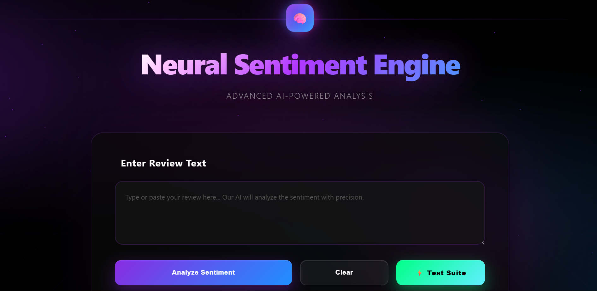
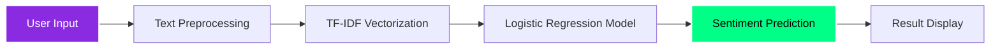

<div align="center">
  
</div>

<div align="center">
  
  
  
  
  
  
  [](.)
  [](.)
  [](LICENSE)
  
  
  
  

  <h3>🧠 Advanced Machine Learning System for Sentiment Analysis</h3>
  <p>Trained on 500,000+ Amazon reviews with 91.13% accuracy using state-of-the-art NLP techniques</p>

</div>

---

## 📑 Table of Contents

- [Project Overview](#-project-overview)
- [Demo](#-demo)
- [Architecture](#️-architecture)
- [Tech Stack](#️-tech-stack)
- [Model Performance](#-model-performance)
- [Features](#-features)
- [Quick Start](#-quick-start)
  - [Prerequisites](#prerequisites)
  - [Installation](#installation)
- [Project Structure](#-project-structure)
- [Usage](#-usage)
  - [Web Interface](#web-interface)
  - [API Usage](#api-usage)
- [How It Works](#-how-it-works)
- [Dataset](#-dataset)
- [Configuration](#-configuration)
- [Testing](#-testing)
- [Performance Optimization](#-performance-optimization)
- [Troubleshooting](#-troubleshooting)
- [Roadmap](#️-roadmap)
- [Contributing](#-contributing)
- [License](#-license)
- [Author](#-author)
- [Acknowledgments](#-acknowledgments)

---

## 🎯 Project Overview

This project implements a **high-performance sentiment analysis system** that classifies Amazon product reviews as **Positive** or **Negative**. Built with advanced Natural Language Processing (NLP) and Machine Learning techniques, it achieves **91.13% accuracy** on real-world data.

### ✨ Key Highlights

- 🎯 **91.13% Classification Accuracy**
- 📊 **Trained on 500,000+ Reviews**
- 🧠 **Logistic Regression with TF-IDF**
- 🚀 **Real-time Flask API**
- 💫 **Beautiful Interactive UI**
- ⚡ **Optimized Performance**

---

## 🎥 Demo

<div align="center">
  
  ### 🌐 **[Live Demo Coming Soon →](#)**
  
  
  
  *AI-Powered Sentiment Analysis in Action*
  
</div>

---

## 🏗️ Architecture



---

## 🛠️ Tech Stack

### Core Technologies

| Technology | Purpose | Version |
|------------|---------|---------|
|  | Core Language | 3.8+ |
|  | ML Framework | 1.3.0 |
|  | Web Framework | 2.3.0 |
|  | NLP Processing | 3.8.0 |
|  | Data Processing | 2.0.0 |
|  | Numerical Computing | 1.24.0 |

### Machine Learning Pipeline

```python
Text Input → Preprocessing → TF-IDF → Logistic Regression → Prediction
```

---

## 📊 Model Performance

<div align="center">

### 🎯 Classification Results

| Metric | Score |
|--------|-------|
| **Accuracy** | **91.13%** |
| **Precision** | 91% |
| **Recall** | 91% |
| **F1-Score** | 91% |

</div>

### 📈 Model Comparison

| Model | Accuracy | Training Time |
|-------|----------|---------------|
| **Logistic Regression (C=2.0)** ⭐ | **91.13%** | 22.13s |
| Logistic Regression (C=5.0) | 91.07% | 23.42s |
| Linear SVC | 90.76% | 20.40s |
| Naive Bayes | 87.91% | 0.17s |

### 🔬 Detailed Classification Report

```
              precision    recall  f1-score   support

   Negative       0.91      0.91      0.91     25155
   Positive       0.91      0.91      0.91     24845

   accuracy                           0.91     50000
  macro avg       0.91      0.91      0.91     50000
weighted avg       0.91      0.91      0.91     50000
```

---

## ⚡ Features

<table>
<tr>
<td width="50%">

### 🎨 User Interface
- ✨ Modern glassmorphism design
- 🌈 Animated gradient backgrounds
- 📱 Fully responsive layout
- 🎭 Real-time sentiment display
- 💫 Smooth transitions & effects

</td>
<td width="50%">

### 🧠 ML Capabilities
- 🎯 91.13% accuracy rate
- ⚡ Real-time predictions
- 📊 TF-IDF with 50K features
- 🔄 Advanced text preprocessing
- 🎲 Ensemble learning support

</td>
</tr>
<tr>
<td width="50%">

### 🚀 API Features
- 🔌 RESTful API endpoints
- 📝 JSON request/response
- 🧪 Built-in test suite
- 📊 Confidence scores
- 🛡️ Error handling

</td>
<td width="50%">

### 🔧 Technical Features
- 🧹 Advanced text cleaning
- 📚 NLTK preprocessing
- 🔤 Lemmatization
- 🚫 Stop words removal
- 📈 N-gram analysis

</td>
</tr>
</table>

---

## 🚀 Quick Start

### Prerequisites

```bash
Python 3.8+
pip (Python package manager)
```

### Installation

1️⃣ **Clone the repository**

```bash
git clone https://github.com/nada-elbendary/Amazon-Sentiment-Analysis.git
cd Amazon-Sentiment-Analysis
```

2️⃣ **Install dependencies**

```bash
pip install -r requirements.txt
```

3️⃣ **Download NLTK data**

```python
import nltk
nltk.download('stopwords')
nltk.download('wordnet')
nltk.download('omw-1.4')
```

4️⃣ **Run the application**

```bash
python app.py
```

5️⃣ **Open your browser**

```
http://localhost:5000
```

---

## 📁 Project Structure

```
Amazon-Sentiment-Analysis/
│
├── 📄 app.py                          # Flask application
├── 🎨 templates/
│   └── index.html                     # Frontend UI
├── 📸 screenshots/                     # Demo screenshots
│   ├── main.png                        # Main interface
│   ├── negative.png                    # Negative result
│   ├── positive.png                    # Positive result
│   └── test.png                        # Test suite
├── 📓 notebooks/                       # Jupyter notebooks
│   └── amazon_review_classifier_py.ipynb  # Model training
├── 🧠 final_sentiment_model.pkl       # Trained ML model
├── 📊 final_tfidf_vectorizer.pkl      # TF-IDF vectorizer
├── 📋 requirements.txt                # Dependencies
├── 📄 LICENSE                         # MIT License
├── 🚫 .gitignore                      # Git ignore file
└── 📖 README.md                       # Documentation
```

---

## 📓 Training Notebook

**[📊 View Full Training Process →](notebooks/amazon_review_classifier_py.ipynb)**

The notebook includes:
- 📊 **Exploratory Data Analysis (EDA)**
- 🧹 **Data Preprocessing & Cleaning**
- 🔬 **Feature Engineering (TF-IDF)**
- 🤖 **Model Training & Comparison**
- 📈 **Performance Evaluation**
- 💾 **Model Serialization**

Key findings from the training process:
- Tested 4 different algorithms
- Logistic Regression achieved best performance (91.13%)
- Trained on 500,000 reviews with balanced classes
- Optimized hyperparameters for production use

---

## 💻 Usage

### Web Interface

1. Open `http://localhost:5000` in your browser
2. Enter a product review in the text area
3. Click **"Analyze Sentiment"**
4. View the prediction with confidence score

### API Usage

#### Predict Sentiment

```bash
curl -X POST http://localhost:5000/api/predict \
  -H "Content-Type: application/json" \
  -d '{"review": "This product is amazing!"}'
```

**Response:**

```json
{
  "original_text": "This product is amazing!",
  "cleaned_text": "product amazing",
  "prediction_label": 2,
  "sentiment": "Positive",
  "emoji": "😊",
  "confidence": 95.23,
  "status": "success"
}
```

#### Error Response

```json
{
  "error": "Invalid input",
  "message": "Review text cannot be empty",
  "status": "error"
}
```

#### Run Test Suite

```bash
curl http://localhost:5000/api/test
```

#### API Information

```bash
curl http://localhost:5000/api/info
```

---

## 🔬 How It Works

### 1️⃣ **Text Preprocessing**

```python
def clean_text_advanced(text):
    # Convert to lowercase
    text = text.lower()
    
    # Remove punctuation
    text = text.translate(punctuation_table)
    
    # Remove numbers
    text = re.sub(r'\d+', '', text)
    
    # Remove stopwords & apply lemmatization
    words = [lemmatizer.lemmatize(word) 
             for word in text.split() 
             if word not in stop_words]
    
    return " ".join(words)
```

### 2️⃣ **Feature Extraction**

- **TF-IDF Vectorization** with 50,000 features
- **N-grams**: Unigrams + Bigrams (1-2 words)
- **Min/Max Document Frequency**: 3 / 0.9
- **Sublinear TF scaling** for better performance

### 3️⃣ **Model Training**

- **Algorithm**: Logistic Regression (C=2.0)
- **Solver**: SAGA optimizer
- **Training Data**: 500,000 reviews
- **Test Data**: 50,000 reviews
- **Classes**: Binary (Negative=1, Positive=2)

### 4️⃣ **Prediction Pipeline**

```
Input Text → Clean → Vectorize → Model → Confidence Score → Result
```

---

## 📊 Dataset

### 📦 Source
- **Name**: Amazon Review Polarity Dataset
- **Source**: Kaggle
- **Total Size**: 4,000,000 reviews
- **Training Set**: 500,000 reviews (sampled)
- **Test Set**: 50,000 reviews (sampled)

### 📈 Distribution

| Label | Count | Percentage |
|-------|-------|------------|
| Positive (2) | ~250,000 | 50% |
| Negative (1) | ~250,000 | 50% |

### 🔍 Sample Data

```
Positive Review: "This product is absolutely amazing! Best purchase ever!"
Negative Review: "Terrible quality. Waste of money. Very disappointed."
```

---

## 🎨 UI Preview

<div align="center">

### 🏠 Main Interface


*Modern glassmorphism design with gradient backgrounds and smooth animations*

---

### ❌ Negative Sentiment Detection


*Real-time analysis showing negative review with 100% confidence*

---

### ✅ Positive Sentiment Detection


*Accurate positive sentiment classification with detailed breakdown*

---

### 🧪 Test Suite Dashboard


*Comprehensive testing with 7 different review scenarios*

</div>

---

## 🔧 Configuration

### Model Parameters

```python
# TF-IDF Configuration
max_features = 50000
ngram_range = (1, 2)
min_df = 3
max_df = 0.9

# Logistic Regression
C = 2.0
solver = 'saga'
max_iter = 1000
```

### Flask Configuration

```python
host = '0.0.0.0'
port = 5000
debug = True
```

---

## 🧪 Testing

### Run All Tests

```bash
# Via Web Interface
Click "⚡ Test Suite" button

# Via API
curl http://localhost:5000/api/test
```

### Test Cases

```python
test_reviews = [
    "This product is absolutely amazing! I love it!",  # → Positive
    "Terrible quality, waste of money.",                # → Negative
    "It's okay, nothing special.",                     # → Negative
    "Best purchase ever! Highly recommended!",         # → Positive
    "Disappointed and frustrated."                     # → Negative
]
```

---

## 📈 Performance Optimization

### Current Optimizations

✅ **Sparse Matrix Operations** - Efficient memory usage  
✅ **Parallel Processing** - Multi-core training  
✅ **Sublinear TF Scaling** - Better feature normalization  
✅ **Optimized Vectorization** - Fast inference  
✅ **Caching** - Quick repeated predictions  

### Speed Benchmarks

| Operation | Time |
|-----------|------|
| Single Prediction | ~5ms |
| Batch (100 reviews) | ~50ms |
| Model Loading | ~200ms |

---

## 🔧 Troubleshooting

### Common Issues

#### ❌ NLTK Data Not Found

**Problem:** `LookupError: Resource stopwords not found`

**Solution:**
```bash
python -m nltk.downloader stopwords wordnet omw-1.4
```

Or run this in Python:
```python
import nltk
nltk.download('stopwords')
nltk.download('wordnet')
nltk.download('omw-1.4')
```

---

#### ❌ Model File Not Found

**Problem:** `FileNotFoundError: final_sentiment_model.pkl not found`

**Solution:**
- Make sure you have the model files in the root directory
- Download from releases or retrain the model using the notebook

---

#### ❌ Port Already in Use

**Problem:** `OSError: [Errno 48] Address already in use`

**Solution:**
```bash
# Option 1: Kill the process using port 5000
lsof -ti:5000 | xargs kill -9

# Option 2: Change port in app.py
app.run(host='0.0.0.0', port=5001)
```

---

#### ❌ Import Errors

**Problem:** `ModuleNotFoundError: No module named 'flask'`

**Solution:**
```bash
# Install all dependencies
pip install -r requirements.txt

# Or install individually
pip install flask scikit-learn pandas numpy nltk
```

---

#### ❌ Memory Error During Training

**Problem:** `MemoryError` when training on full dataset

**Solution:**
- Reduce dataset size in the notebook
- Use batch processing
- Increase system RAM or use cloud services

---

#### ❌ Prediction Returns Wrong Results

**Problem:** Model gives unexpected predictions

**Solution:**
- Check if NLTK data is properly downloaded
- Ensure model and vectorizer files match
- Verify text preprocessing is working correctly

---

## 🛣️ Roadmap

### ✅ Completed
- [x] Basic sentiment analysis
- [x] Flask API implementation
- [x] Modern UI with animations
- [x] Model optimization (91.13% accuracy)
- [x] API documentation
- [x] Comprehensive README

### 🚧 In Progress
- [ ] Deploy to production (Render/Heroku)
- [ ] Add screenshots and demo GIF
- [ ] Model explainability (LIME/SHAP)

### 🎯 Future Plans
- [ ] Multi-language support
- [ ] Real-time streaming analysis
- [ ] Deep Learning models (BERT/Transformers)
- [ ] Aspect-based sentiment analysis
- [ ] Mobile app (React Native)
- [ ] Chrome extension
- [ ] Docker containerization

---

## 🤝 Contributing

Contributions are welcome! Here's how you can help:

### How to Contribute

1. **Fork the repository**
2. **Create your feature branch**
   ```bash
   git checkout -b feature/AmazingFeature
   ```
3. **Commit your changes**
   ```bash
   git commit -m 'Add some AmazingFeature'
   ```
4. **Push to the branch**
   ```bash
   git push origin feature/AmazingFeature
   ```
5. **Open a Pull Request**

### Contribution Guidelines

- Write clear commit messages
- Update documentation for new features
- Add tests for new functionality
- Follow existing code style
- Check that all tests pass

### Areas for Contribution

- 🐛 Bug fixes
- ✨ New features
- 📝 Documentation improvements
- 🎨 UI/UX enhancements
- 🧪 Test coverage
- 🌍 Multi-language support

---

## 📝 Requirements

```txt
Flask==2.3.0
scikit-learn==1.3.0
pandas==2.0.0
numpy==1.24.0
nltk==3.8.0
gunicorn==21.2.0
```

### Installation

```bash
pip install -r requirements.txt
```

---

## 📄 License

This project is licensed under the MIT License - see the [LICENSE](LICENSE) file for details.

### MIT License Summary

✅ Commercial use  
✅ Modification  
✅ Distribution  
✅ Private use  

---

## 👤 Author

<div align="center">

### **Nada Mohammed Elbendary**

**Machine Learning Engineer | AI Enthusiast**

[](https://www.linkedin.com/in/nada-mohammed5)
[](mailto:nadaelbendary3@gmail.com)
[](https://nada-elbendary.github.io)
[](https://github.com/nada-elbendary)

📍 Based in Egypt 🇪🇬  
🎓 Third-year AI Student  
💼 Open to opportunities in ML/AI

</div>

---

## 🙏 Acknowledgments

- **Dataset:** [Kaggle - Amazon Review Polarity](https://www.kaggle.com/datasets/kritanjalijain/amazon-reviews)
- **Inspiration:** Real-world e-commerce applications
- **Tools & Libraries:** Scikit-learn, NLTK, Flask, NumPy, Pandas
- **Community:** Stack Overflow, GitHub, Kaggle forums

---

## 📚 Citation

If you use this project in your research or work, please cite:

```bibtex
@software{elbendary2024amazon,
  author = {Elbendary, Nada Mohammed},
  title = {Amazon Sentiment Analysis System},
  year = {2024},
  publisher = {GitHub},
  url = {https://github.com/nada-elbendary/Amazon-Sentiment-Analysis}
}
```

---

## 📊 Project Stats

<div align="center">


</div>

---

## ⭐ Support

If you found this project helpful, please consider:

- ⭐ **Starring** the repository
- 🐛 **Reporting bugs** via [Issues](https://github.com/nada-elbendary/Amazon-Sentiment-Analysis/issues)
- 💡 **Suggesting features** via [Issues](https://github.com/nada-elbendary/Amazon-Sentiment-Analysis/issues)
- 🔀 **Forking** and contributing
- 📢 **Sharing** with others who might find it useful

---

<div align="center">
  
### 💡 **Made with ❤️ and Machine Learning**

### 🚀 **"Transforming Reviews into Insights, One Sentiment at a Time"**


</div>
